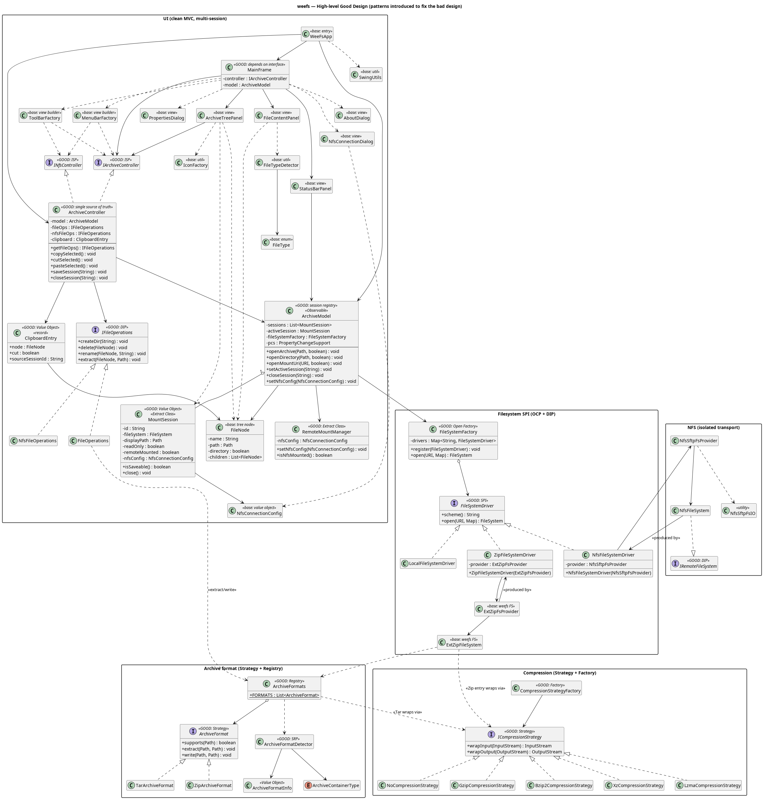

# WeEFS: Extended File System Library for Java

**WeEFS** is a Java NIO.2-compatible file-system library that abstracts **ZIP, TAR and GZIP archives** and **NFS mounts** as
standard `java.nio.file.FileSystem` instances. This project was built as a mini-project for the course of **Object Oriented Design and Analysis** and is shipped with a simple UI, built using `Swing` GUI-tooklit library.

---

## Features

| Capability | Description |
|---|---|
| **Archive browsing** | Open ZIP and TAR files as virtual file systems. |
| **NFS support** | Mount NFS exports and browse/edit remote files. |
| **NIO.2 SPI** | Custom `FileSystemProvider` implementations (`xzip://`, `nfs://`). |
| **Swing GUI** | Tree browser, file previewer/editor, toolbar, menus. |
| **Strategy-based formats** | Pluggable `ArchiveFormat` strategy (ZIP, TAR — extensible). |
| **Read/Write** | Create, rename, delete, copy, and save files in both backends. |

---

## Requirements

- **Java 21+** (tested with OpenJDK 25)
- [just](https://github.com/casey/just) command runner (optional, you can
  invoke `javac`/`jar` and fetch dependencies manually too)

There are certain other dependancies, but they can all be fetched with `just deps` command which pulls all the dependancies into `lib` folder. These are:
      
### For archive and compression:
| Library                                | Version | Purpose                          |
|----------------------------------------|---------|----------------------------------|
| jtar (org.kamranzafar)                 | 2.3     | TAR archive read/write           |
| commons-compress (org.apache.commons)  | 1.27.1  | BZip2, LZMA compression streams  |
| xz (org.tukaani)                       | 1.10    | XZ/LZMA2 compression streams     |
| commons-io (org.apache.commons)        | 2.18.0  | File utility helpers             |

    
### For Remote, SSH and web server:
| Library                          | Version | Purpose                                  |
|----------------------------------|---------|------------------------------------------|
| JSch (com.jcraft)                | 0.1.55  | SFTP client (NFS-over-SFTP operations)   |
| Apache MINA sshd-core            | 2.11.0  | SFTP server,  serves archives over SSH   |
| Apache MINA sshd-sftp            | 2.11.0  | SFTP subsystem for the archive server    |
| Apache MINA sshd-common          | 2.17.1  | Shared MINA SSHD types                   |
| spring-boot                                                             | 2.7.18  | Application context bootstrap    |
| spring-core / spring-beans / spring-context / spring-expression / spring-aop / spring-jcl | 5.3.31  | IoC container, dependency injection |


### For UI and logging:
| Library                    | Version | Purpose                                      |
|----------------------------|---------|----------------------------------------------|
| FlatLaf (com.formdev)      | 3.5.4   | Modern Swing Look & Feel (light/dark theme)  |
| slf4j-api                  | 2.0.16  | Logging facade (used by MINA sshd)           |
| slf4j-simple               | 2.0.16  | Simple logging backend                       |

---

## Quick Start

```bash
# Clone and build
git clone https://github.com/nikhilr612/weefs && cd weefs
just build          # downloads dependencies, compiles and builds artifact.jar

# Run the GUI
just run-gui

# Run integration tests
just test-all     # runs all tests
just run          # archive integration tests
just test-nfs     # NFS tests
just test-ui      # UI integration tests
```

---

## Project Structure

```
weefs/
├── src/io/wfs/
│   ├── core/
│   │   ├── extractor/   # Archive FileSystem SPI (ZIP, TAR)
│   │   │   ├── ArchiveFormat.java          # Strategy interface
│   │   │   ├── ZipArchiveFormat.java       # ZIP strategy
│   │   │   ├── TarArchiveFormat.java       # TAR strategy
│   │   │   ├── ArchiveFormats.java         # Registry / resolver
│   │   │   ├── ExtZipFsProvider.java       # NIO.2 FileSystemProvider
│   │   │   ├── ExtZipFileSystem.java       # FileSystem implementation
│   │   │   ├── ExtZipPath.java             # Path implementation
│   │   │   ├── ExtZipFsIO.java             # I/O utilities
│   │   │   └── ExtZipDirectoryStream.java  # Directory iteration
│   │   └── nfs/         # NFS FileSystem SPI
│   │       ├── NfsFsProvider.java          # NIO.2 FileSystemProvider
│   │       ├── NfsFileSystem.java          # FileSystem implementation
│   │       ├── NfsPath.java                # Path implementation
│   │       ├── NfsIO.java                  # I/O utilities (with path-traversal guards)
│   │       ├── NfsConnectionConfig.java    # Connection parameters (validated)
│   │       └── NfsFileInfo.java            # File metadata DTO
│   ├── main/            # CLI entry points and integration tests
│   │   ├── App.java
│   │   ├── ArchiveIntegrationTest.java
│   │   └── NfsIntegrationTest.java
│   └── ui/              # Swing desktop application
│       ├── WeeFsApp.java / MainLauncher.java
│       ├── controller/
│       │   ├── IArchiveController.java     # Archive ops interface
│       │   ├── INfsController.java         # NFS ops interface
│       │   ├── IFileOperations.java        # Unified file ops (Strategy)
│       │   ├── ArchiveController.java      # Main controller
│       │   ├── FileOperations.java         # Archive file mutations
│       │   └── NfsFileOperations.java      # NFS file mutations
│       ├── model/
│       │   ├── ArchiveModel.java           # Central state + Observer
│       │   └── FileNode.java               # Immutable file record
│       ├── view/
│       │   ├── MainFrame.java              # Application window
│       │   ├── ArchiveTreePanel.java       # Tree browser
│       │   ├── FileContentPanel.java       # File viewer/editor
│       │   ├── MenuBarFactory.java         # Menu bar
│       │   ├── ToolBarFactory.java         # Toolbar
│       │   ├── StatusBarPanel.java         # Status bar
│       │   └── FileTreeCellRenderer.java   # Tree icons
│       └── util/
│           ├── FileTypeDetector.java       # MIME detection
│           ├── IconFactory.java            # Icon provider
│           └── SwingUtils.java             # UI helpers
├── lib/                 # External dependancy JARs
├── bin/                 # Compiled output
├── justfile             # No build systems, contains shorthands for commands
```

---

## Architecture

The UI is built using MVC design pattern. It uses the  as a library and lets user interact with different file systems uniformly. Here is a high level design of the entire project:



### Key Design Patterns used

| Pattern | Where |
|---|---|
| **Strategy** | `ArchiveFormat` (ZIP/TAR), `IFileOperations` (archive/NFS) |
| **Observer** | `PropertyChangeSupport` in `ArchiveModel` |
| **Adapter** | `ExtZipFileSystem` / `NfsFileSystem` adapt archives and NFS to NIO.2 |
| **Command** | Action lambdas wired up in menus and toolbar |
| **Composite** | File system is rendered as a tree using composite pattern |
| **Flyweight** | Child nodes and the data on the nodes themselves are lazy-loaded |

---

## Documentation

All existing documentation can be found in  folder. This folder contains various UML diagrams which explain the project architecture in detail.

---

## License

See [LICENSE](LICENSE).
